<link href="Additional/39/md-style.css" rel="stylesheet"></link>

# 第39回BSS（マークダウンでドキュメント作成)

日時　：2021年 3月10日(水)  
参加者：古川(発表者)・有川・森

---
***今回の趣旨***
* マークダウンを効率的に編集するためのプラグインと使い方
* マークダウンで図を書く（mermaid.js）

<br>

***目次***
  - [VSコードで効率よくマークダウン編集](#vsコードで効率よくマークダウン編集)
    - [スタイルシートを読み込む (VSプレビュー)](#スタイルシートを読み込む-vsプレビュー)
    - [Markdown All in One (VSプラグイン)](#markdown-all-in-one-vsプラグイン)
      - [よく使いそうなショートカットキー一覧](#よく使いそうなショートカットキー一覧)
      - [画像貼り付けの例](#画像貼り付けの例)
      - [目次を生成する](#目次を生成する)
      - [mdファイルを開いたときに自動でサイドバーにプレビューを表示する](#mdファイルを開いたときに自動でサイドバーにプレビューを表示する)
    - [Excel to Markdown table (VSプラグイン)](#excel-to-markdown-table-vsプラグイン)
    - [Markdown Preview Mermaid Support（VSプラグイン）](#markdown-preview-mermaid-supportvsプラグイン)
    - [Markdown Preview Enhanced（VSプラグイン）](#markdown-preview-enhancedvsプラグイン)
    - [参考サイト](#参考サイト)
  - [テキストベースでフローチャートやシーケンス図を書く（mermaid.js）](#テキストベースでフローチャートやシーケンス図を書くmermaidjs)
    - [書き方](#書き方)
      - [マークダウン](#マークダウン)
      - [HTML](#html)
    - [フローチャートの例](#フローチャートの例)
      - [グラフの方向](#グラフの方向)
      - [ノード形状](#ノード形状)
      - [リンク](#リンク)
      - [グルーピング](#グルーピング)
      - [装飾](#装飾)
    - [シーケンス図の例](#シーケンス図の例)
      - [簡単な例](#簡単な例)
      - [線の書き方（実線、点線、矢印、X矢印）](#線の書き方実線点線矢印x矢印)
      - [ライフライン](#ライフライン)
      - [ライフライン（簡単Ver）](#ライフライン簡単ver)
      - [メモ](#メモ)
      - [複合フラグメント](#複合フラグメント)
    - [ガントチャートの例](#ガントチャートの例)
      - [簡単な例](#簡単な例-1)
      - [休日、祝日を考慮](#休日祝日を考慮)
    - [参考サイト](#参考サイト-1)
<br>

---
## VSコードで効率よくマークダウン編集

### スタイルシートを読み込む (VSプレビュー)

やっぱ見た目は大事デス。  
ただし、この後に出てくる「Markdown Preview Enhanced」のプレビューでは有効にならない。

**使い方**  
1. CSSファイルを作成（例: md-style0.css）
2. 本文の上の方に以下を埋め込む
```html
<link href="md-style.css" rel="stylesheet"></link>
```
<br>

---
### Markdown All in One (VSプラグイン)


#### よく使いそうなショートカットキー一覧
| キー                 | 結果             |
|----------------------|----------------|
| Command + b             | 太字             |
| Command + i             | 斜体             |
| Ctrl + shift + ]     | ヘッディングレベル上げ    |
| ctrl + shift + [     | ヘッディングレベル下げ    |
| 範囲選択 + Command + V  | リンクの設定         |
| Alt + C              | チェックボックスの有効/無効 |

<br>

#### 画像貼り付けの例
1. 画像ファイルへのリンクをクリップボードにコピー
2. ALT属性の文字列を入力（例: "BAUWORKSのアイコン"）
3. ALT属性を範囲選択して [Ctrl] + [V] ⇒ リンク表示される
4. リンク文字列の"[xxxx]"の前に "!" を入力 ⇒ リンク表示が画像ファイルに変わる


   実行例：  
   
<br>

#### 目次を生成する
**使い方**  
コマンドパレット： Ctrl + Shift + "P"
~~~
 Markdown All in One: Create Table of Contents 
~~~
<br>

#### mdファイルを開いたときに自動でサイドバーにプレビューを表示する

**使い方**  
設定： Command + ","
~~~
 Markdown > Extension > Preview: Auto Show Preview To Side  
 - [x] 自動でプレビューを横に表示する
~~~
<br>

---
### Excel to Markdown table (VSプラグイン)


Excelでコピーした範囲をマークダウン形式で貼り付けることができる。  
Windowsでは便利。Macではあまり使わないかも。


**使い方**  
 Excelで作成したテーブルをコピーして `Shift + Alt + V` で貼り付け。


貼り付けた例：
| No | SVN Rev | Z-SYS Ver | 説明                       |
|----|---------|-----------|--------------------------|
| 1  | r2282   | V3.3.0    | 本番機取得ソースコード       |
| 2  | r2287   | V3.3.1    | 今回改定前のソースコード |
| 3  | r2461   | V4.0.0    | 今回改定を実施したソースコード（3/3時点）   |

<br>

---
### Markdown Preview Mermaid Support（VSプラグイン）


プレビューでmermaid.jsで書いた図を解釈してくれる。  
<br>

---
### Markdown Preview Enhanced（VSプラグイン）


機能強化されたプレビューが追加される。  
もちろんmermaid.jsで書いた図も解釈してくれる。  
`Markdown Preview Mermaid Support` はデフォルトで搭載されているプレビューのサポート機能なので、mermaid.jsで書かれた図の描画だけが目的なら、このプラグインは使わなくていいかも。
<br>

### 参考サイト
* [Markdownでスタイルシート](https://qiita.com/skkzsh/items/99e30bbbfe69f379b583)  

<br>
<br>

---
## テキストベースでフローチャートやシーケンス図を書く（mermaid.js）

### 書き方
#### マークダウン
   コードスタイル（mermaid）で記述

```
\```mermaid
graph LR
A-->B
\```
```
※ エスケープ記号`\`は不要

以下のように表示される。
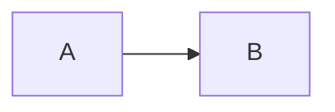
<br>

#### HTML
```html
<!DOCTYPE html>
<html lang="ja">
<head>
  <meta charset="utf-8">
</head>
<body>
  <div class="mermaid">
    graph LR
    A-->B
  </div>
  <script src="https://unpkg.com/mermaid/dist/mermaid.min.js"></script>
  <script>mermaid.initialize({startOnLoad:true});</script>
</body>
</html>
```
<br>

---
### フローチャートの例

#### グラフの方向

LR：レフトからライト
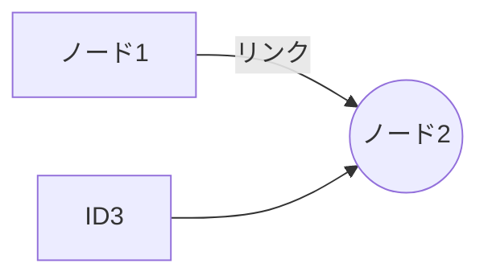

TB：トップからボトム
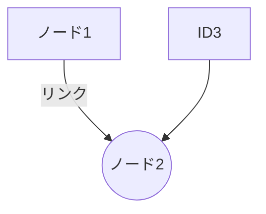
<br>

#### ノード形状


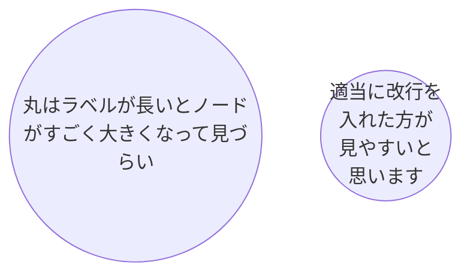
<br>

#### リンク
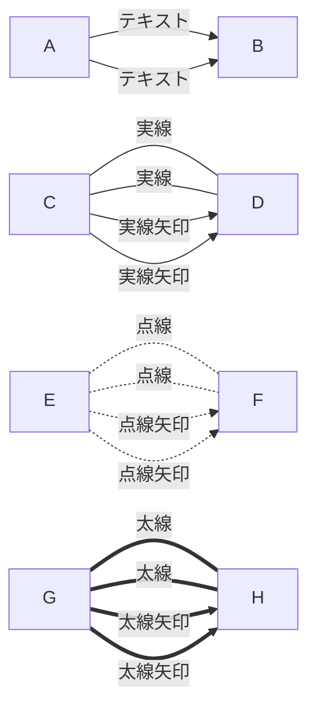
<br>

#### グルーピング
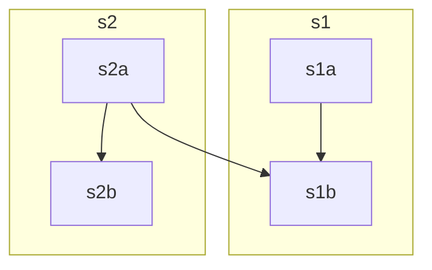


ノードは最初にIDの記載が現れた subgraph 内に配置されるので左記にグルーピングしてからリンク定義するとよい。
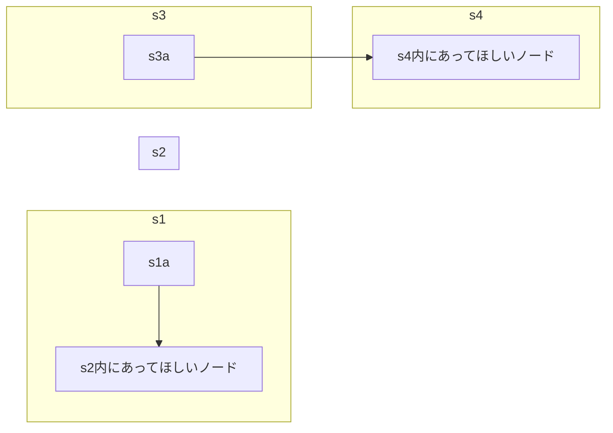
<br>


#### 装飾
* ノードの装飾：`style`
* リンクの装飾：`linkStyle`
  linkStyle 通し番号 のように、0始まりでリンクの通し番号を指定する。
  対象のリンクより先に linkStyle を書くと正しく出力されない。
  通し番号は0始まり

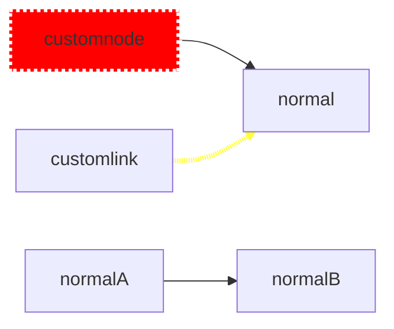
<br>

* クラス定義による装飾
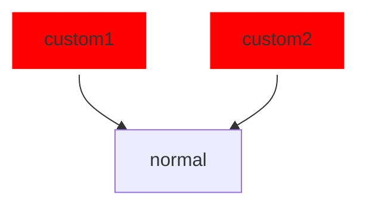

<br>

---
### シーケンス図の例
#### 簡単な例
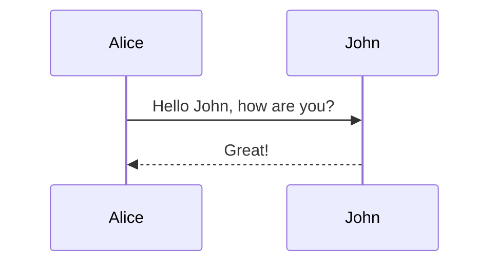
<br>

#### 線の書き方（実線、点線、矢印、X矢印）
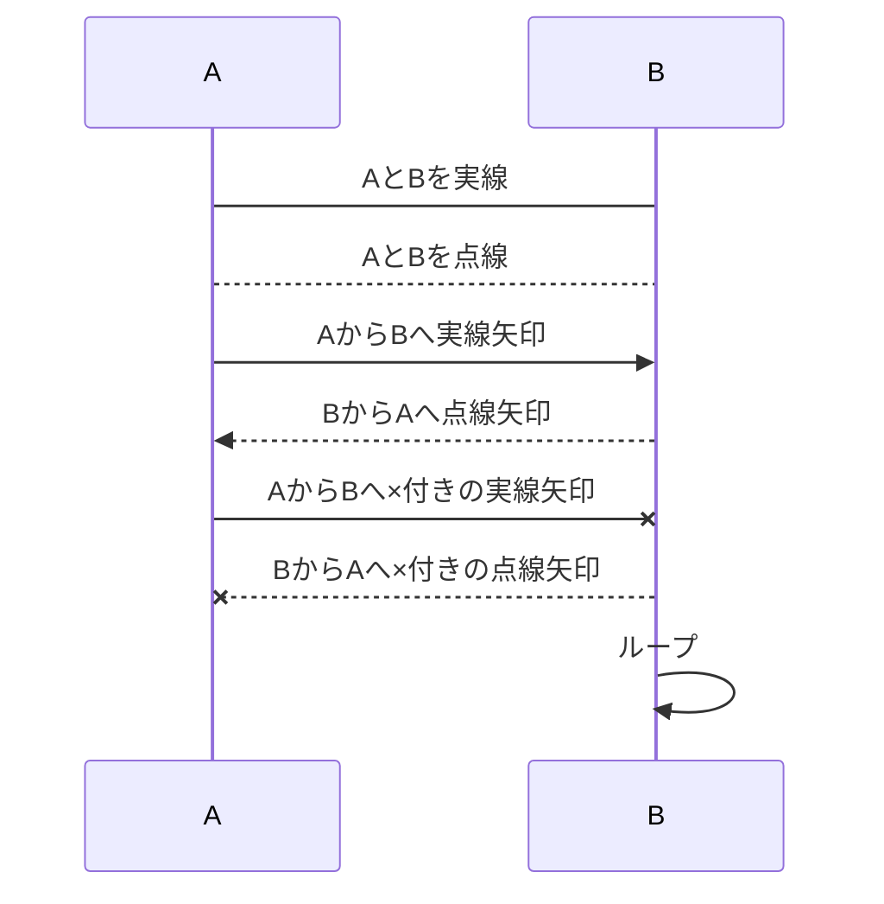
<br>

#### ライフライン
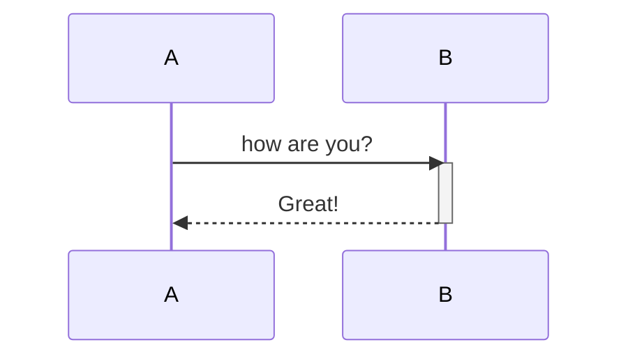
<br>

#### ライフライン（簡単Ver）
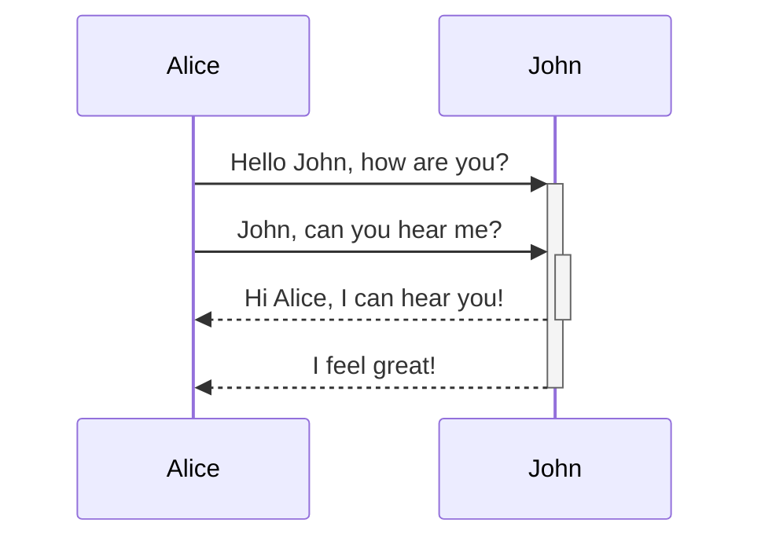
<br>

#### メモ

Note [Position] [Actor]
+ [Position] : `right of`, `left of`, `over`
+ [Actor]    : 誰につけるか？（overの場合は複数）

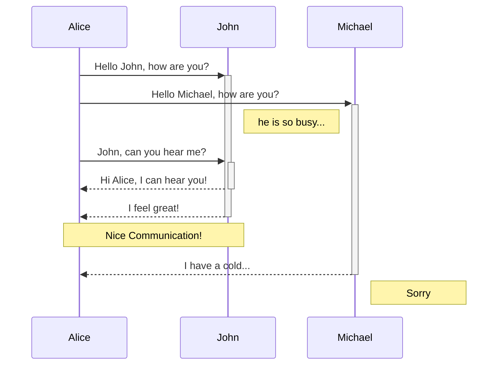

#### 複合フラグメント


* loop
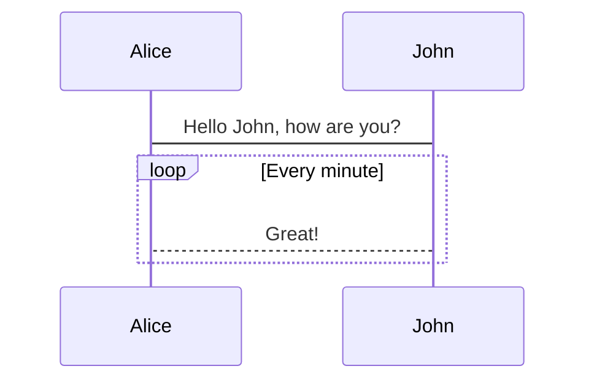
<br><br>

* alt, opt, par
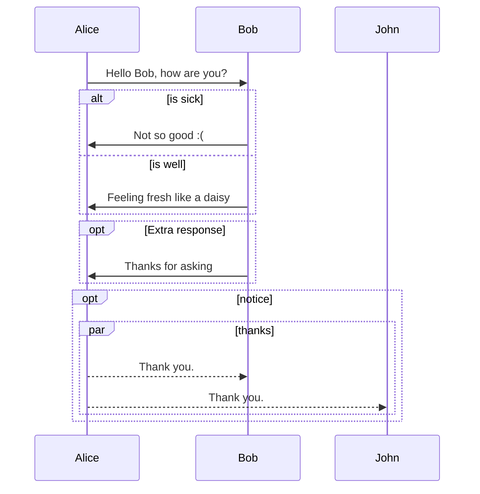

<br>

---
### ガントチャートの例
#### 簡単な例
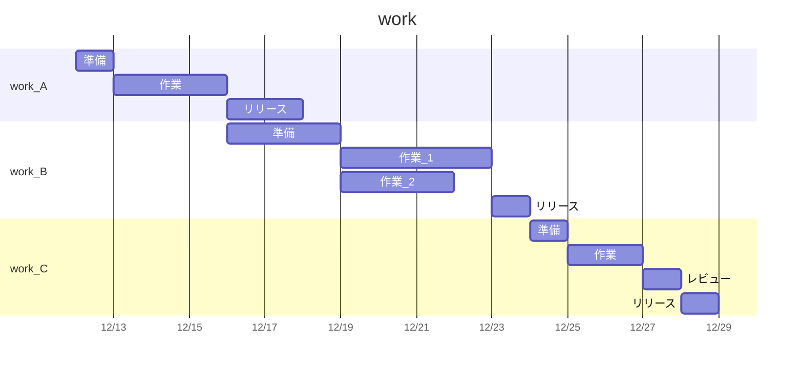

<br>

#### 休日、祝日を考慮

`excludes` に週末なら `weekends` 、祝日は日付を直接指定する。  


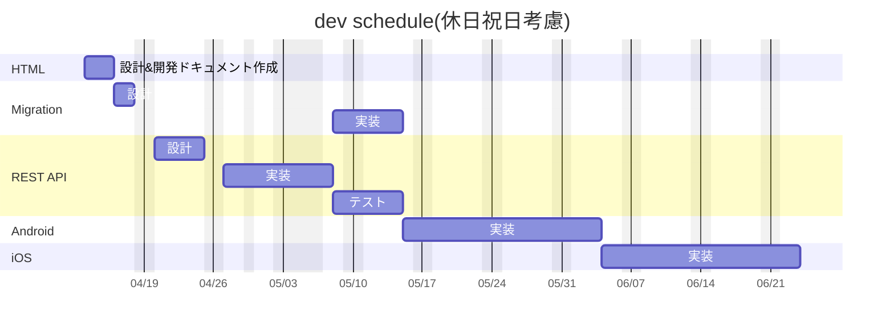
<br>

---
### 参考サイト
* [mermaid.jsのフローチャートの書き方](https://ryuta46.com/516)  
* [VScodeでmermaidを使ったmarkdown資料作りメモ](https://qiita.com/ZOOSHIMA/items/693ee8fd93146dd69b0e)  
* [Mermaid.js コードでガントチャートを書く 簡易編](https://qiita.com/miriwo/items/7df0024d4098302e5721)  
* [mermaidのガントチャートで休日と祝日を考慮して表示する方法](https://qwx.jp/mermaid-ganttchart-excludes-weekends-and-holiday/)  

